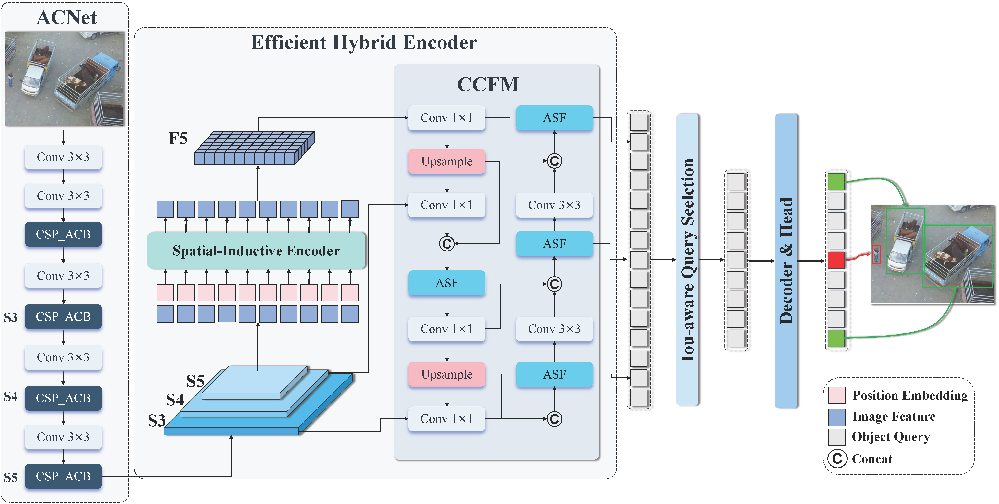
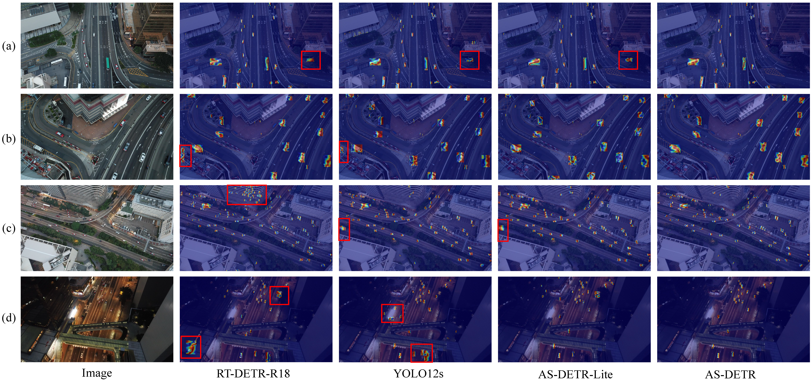

# 🚁Asymmetric Context and Spatial-Inductive Attention networks for UAV Object Detection

## 📌 Introduction

AS-DETR is a highly efficient and lightweight detection paradigm tailored for **Unmanned Aerial Vehicle (UAV)** imagery.

UAV small object detection remains a formidable challenge due to the loss of high-frequency details, severe background noise, and the strict computational limits of edge devices.

While recent RT-DETR models achieve impressive performance, their reliance on dense convolutions and global attention mechanisms exacerbates feature degradation and memory-bound latency.

AS-DETR effectively breaks these bottlenecks, achieving a groundbreaking inference speed of **171.2 FPS** with competitive accuracy on the **VisDrone2019** dataset, establishing an optimal trade-off between accuracy and inference speed for real-time UAV object detection.

---

## 🏗️ Architecture

<p align="center">
  
</p>

---

## ✨ Key Features

### ACNet (Asymmetric Context Network)

* Replaces traditional backbones with an asymmetric dual-path architecture.
* One path preserves local high-frequency details via identity mapping.
* The other captures global context using an Axial Convolutional Attention (ACA) engine.

### SIE (Spatial-Inductive Encoder)

* Completely replaces standard global attention.
* Utilizes 2D overlapping sliding windows and relative position biases.
* Reduces computational complexity to linear complexity **O(N)**.
* Establishes robust spatial priors for dense tiny objects.

### ASF (Asymmetric Shuffle Fusion)

* Designed for edge deployment.
* Adopts an extreme **1:3 channel split** strategy.
* Uses group shuffle mechanisms for efficient cross-scale fusion.
* Maximizes throughput while reducing dense MAC operations.

---

# 📊 Model Zoo & Benchmarks

All models are trained and evaluated on a single **NVIDIA GeForce RTX 5070 GPU**.

## 🏆 VisDrone2019 Benchmark

| Model                   | Params(M) | GFLOPs   | FPS       | AP       | AP50     | AP75     | APS      | APM      | APL      |
| ----------------------- | --------- | -------- | --------- | -------- | -------- | -------- | -------- | -------- | -------- |
| RT-DETR-R18             | 19.9      | 57.0     | 32.2      | 18.5     | 32.8     | 19.5     | 11.2     | 28.6     | 35.1     |
| YOLOv12-s               | 9.2       | 21.2     | 82.1      | 17.2     | 29.8     | 17.6     | 8.7      | 27.0     | 37.1     |
| **AS-DETR-Lite (Ours)** | **14.7**  | **46.0** | **171.2** | **20.7** | **35.6** | **21.0** | **12.3** | **30.6** | **39.6** |
| **AS-DETR (Ours)**      | **16.1**  | **52.7** | **151.0** | **22.2** | **37.3** | **22.9** | **13.3** | **32.3** | **41.2** |

---

## 🛰️ SIMD Benchmark

| Model                   | Params(M) | GFLOPs   | FPS       | AP       | AP50     | AP75     |
| ----------------------- | --------- | -------- | --------- | -------- | -------- | -------- |
| RT-DETR-R18             | 19.9      | 57.0     | 41.8      | 63.7     | 78.4     | 73.0     |
| YOLOv10l                | 48.8      | 120.3    | 64.0      | 65.3     | 80.9     | 72.3     |
| YOLOv12l                | 26.5      | 82.4     | -         | 64.8     | 80.1     | 72.1     |
| **AS-DETR-Lite (Ours)** | **14.7**  | **46.0** | **155.6** | **64.3** | **78.7** | **75.6** |
| **AS-DETR (Ours)**      | **16.1**  | **52.7** | **160.9** | **65.7** | **80.8** | **75.0** |

> **Note:** AS-DETR achieves higher accuracy than heavyweight detectors while maintaining significantly higher FPS and lower parameter counts.

---

# ⚙️ Quick Start

## 1. Installation

Clone the repository and install dependencies:

```bash
git clone https://github.com/yourusername/AS-DETR.git
cd AS-DETR
pip install -r requirements.txt
```

## 2. Dataset Preparation

Convert datasets (VisDrone2019, UAVDT, SIMD) into YOLO format and place them under:

```text
dataset/
├── VisDrone/
├── UAVDT/
└── SIMD/
```

## 3. Training

```python
import warnings, os
warnings.filterwarnings('ignore')
from ultralytics import RTDETR

if __name__ == '__main__':
      
    model = RTDETR(r'F:\Code\RTDETR-main\AS-DETR\AS-DETR.yaml')
    # model.load('/home/ubuntu/proejcts/RTDETR-main/weights/rtdetr-r18.pt') # loading pretrain weights
    model.train(data=r'F:\Code\RTDETR-main\dataset\visdrone.yaml',
                cache=False,
                imgsz=640,
                epochs=300,
                batch=4,
                workers=4, 
                device='0', 
               #resume=r'F:\Code\RTDETR-main\runs\trainAS-DETR\+ASF\weights\last.pt', # last.pt path
                project='runs/trainA',
                name='AS-DETR',
                )
    
```

Run training:

```bash
python train.py
```

---

## 4. Evaluation

```bash
python val.py
```

---

# 🔍 Qualitative Results

<p align="center">
  
</p>

Visual comparisons of attention heatmaps demonstrate that traditional models suffer from severe **Attention Drift** in complex aerial scenes, whereas AS-DETR accurately focuses on target regions through Spatial-Inductive Attention.

---

# 📜 Citation

If you find this work useful, please consider citing:

```bibtex
@article{Jing2026asdetr,
  title={AS-DETR: Lightweight Detector for UAV Small Object Detection via Asymmetric Context and Spatial-Inductive Attention},
  author={Jing, Zihao and Wang, Shaoqing and Tang, Weiyan and Zhu, Zhuangrui and Sun, Fuzhen},
  journal={arXiv preprint arXiv:XXXX.XXXXX},
  year={2026}
}
```

---

# 🙏 Acknowledgments

This project is built upon the excellent Ultralytics framework and RT-DETR. We sincerely thank the original authors for their open-source contributions.
